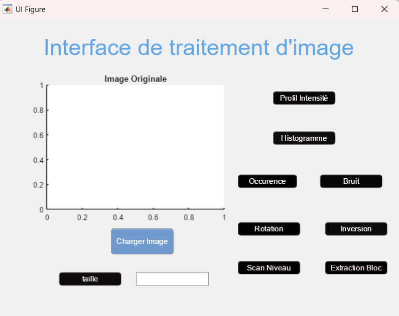
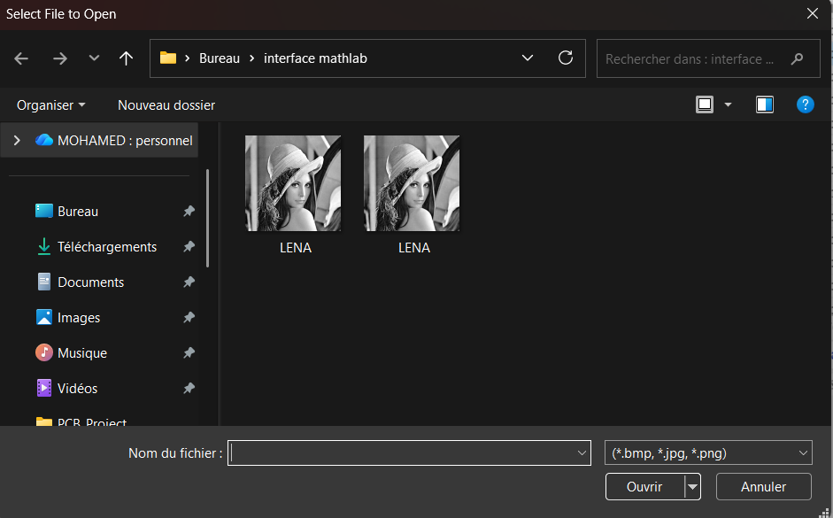
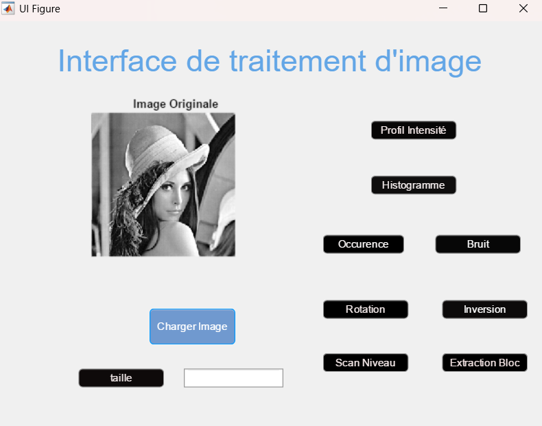

#  MATLAB Image Processing GUI

##  Description
Designed and implemented an interactive MATLAB-based image processing system with GUI, integrating filtering, histogram analysis, and computer vision techniques.
---

##  Features
- Intensity profile
- Histogram analysis
- Noise filtering
- Image rotation
- Image inversion
- Gray level scanning
- Block extraction

---

## Interface Preview

### Empty State

### File Selection

### Main Interface

---

##  Technologies
- MATLAB
- Image Processing Toolbox

---

##  How to Run
1. Open MATLAB
2. Open App Designer
3. Run `App1.mlapp`
4. Click "Charger Image"
5. Test different features

---
## ⭐ Project Highlights

- Developed a complete MATLAB GUI for real-time image processing
- Implemented multiple image processing algorithms (filtering, histogram, transformations)
- Designed an intuitive user interface for interactive analysis
- Structured project for modular and scalable development

##  Author
Mohamed Kammoun
